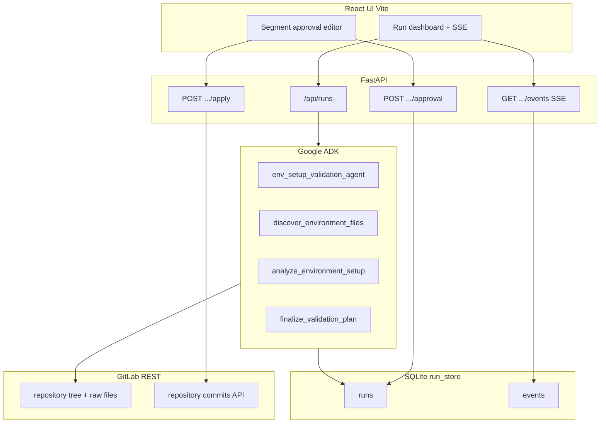

# Architecture overview

## Components

## Agent design

- **Single ADK `Agent`** with three **function tools** (see [`backend/agent/`](backend/agent/)):
  1. **Discovery** — walks the GitLab repository tree, selects environment-related paths, fetches raw contents into `AgentRunContext`.
  2. **Analysis** — deterministic checks (YAML compose ports, Dockerfile `EXPOSE`, unpinned requirements lines, shallow `.env.example` vs compose env gaps).
  3. **Finalize** — persists structured segments and setup instructions into SQLite and sets status to `awaiting_approval`.

The LLM **plans** how to turn findings into coherent multi-file edits and **must** call `finalize_validation_plan` with a JSON array of segments.

## State management

- **Runs** row: status machine `pending → running → awaiting_approval → applying → completed` (or `failed`).
- **Segments** stored as JSON on the run row; approval updates `approved` flags and optional edited bodies.
- **Events** table: append-only rows for SSE replay and auditing (ADK events, discovery, analysis, errors).

## API layer

- REST for commands; **SSE** for push-style traces (`text/event-stream`).
- **No GitLab writes** in phase 1; [`POST /api/runs/{id}/apply`](backend/api/routes_runs.py) is the only commit path.
- The official **ADK HTTP API** is embedded by mounting `google.adk.cli.fast_api.get_fast_api_app` at **`/adk`** in [`backend/main.py`](backend/main.py). That exposes `/adk/run_sse`, `/adk/run`, session CRUD, debug traces, artifacts, etc., per the [ADK REST reference](https://google.github.io/adk-docs/api-reference/rest/). Discovery helper: **`GET /api/adk/endpoints`**.

## Resumability

- Operators can **refresh** the UI: `GET /api/runs/{id}` returns current segments and status.
- Failed apply: run moves to `failed` with GitLab error text on segments; you can fix `.env` / token and start a new run (future: retry partial apply).

## Relation to neurostack

- **GitLab:** [`backend/gitlab_utils.py`](backend/gitlab_utils.py) matches [`modular_agents/agents/sdlc_agents/gitlab_utils.py`](../modular_agents/agents/sdlc_agents/gitlab_utils.py) (project/branch) and [`gitlab_automation_agent/server.py`](../modular_agents/agents/gitlab_automation_agent/server.py) `_resolve_gitlab_auth` (token + default API URL).
- **ADK:** [`backend/services/run_executor.py`](backend/services/run_executor.py) follows the same flow as [`modular_agents/api/routers/agents.py`](../modular_agents/api/routers/agents.py) `execute_agent_with_adk`: create ADK session state, then invoke the mounted stock `/adk/run_sse` endpoint.

There is **no Python import** of `modular_agents` — this folder stays portable; links above are for reviewers comparing behaviour.
